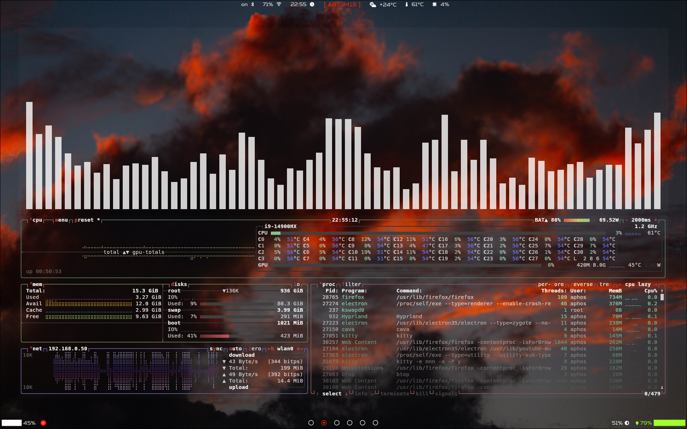
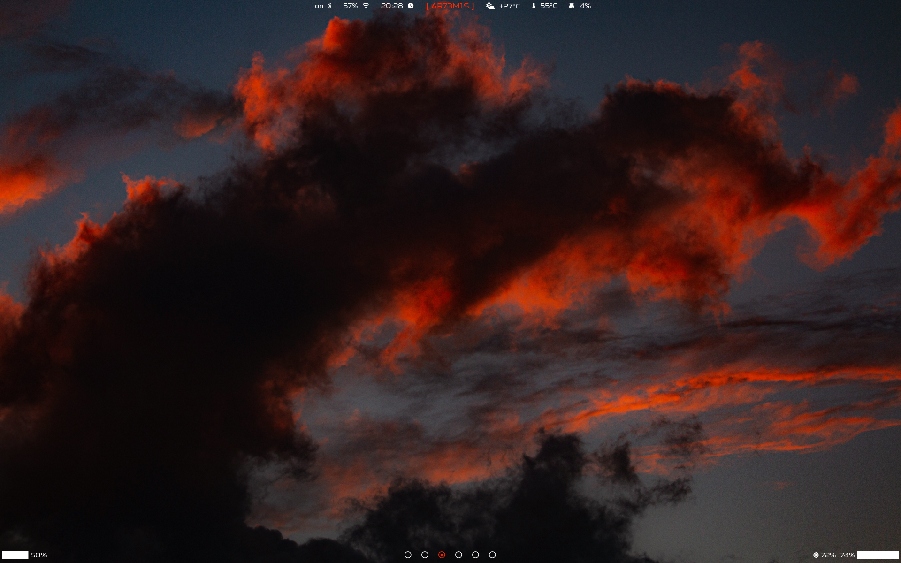

# AR73M1S dots 

Computers have the capacity for love.

# Screenshots

 



## Dependencies 

+ Iosevka Nerd Font 
+ mako
+ hyprpaper
+ hyprlock
+ hypridle
+ nnn
+ nemo
+ nchat
+ viu
+ btop

## Post install tweaks

Create the directory ```/etc/systemd/sleep.conf.d/``` and add the file ```mem-deep.conf``` with this inside: 

```bash
[Sleep]
MemorySleepMode=deep
```
This will stop battery draining while laptop lid is closed
